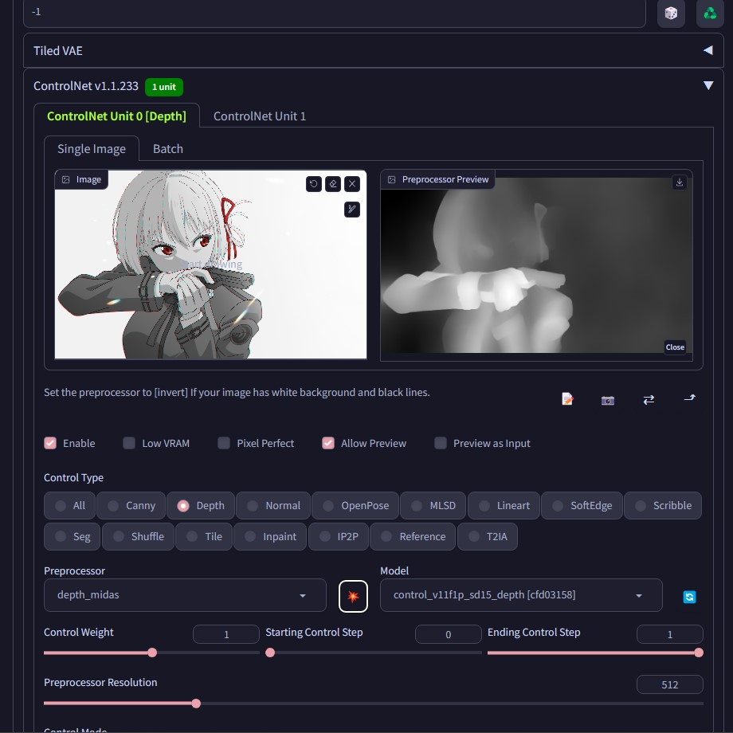

<h2 align="center">Stable Diffusion Automatic1111 Webui 安裝教學</h2>

<b>by. Haoming</b> <i>Last Update: 2023/07/26</i>

1. `git` `clone` https://github.com/AUTOMATIC1111/stable-diffusion-webui
2. 將之前下載的 Checkpoint *(**eg.** [UHD-23](https://civitai.com/models/22371/uhd-23))* 移至 `~\stable-diffusion-webui\models\Stable-diffusion` 資料夾
3. 右鍵編輯 `~\stable-diffusion-webui\webui-user.bat`
4. 將 `--xformers` 以及 `--no-half-vae` 加至 `set COMMANDLINE_ARGS=` 後面 *(兩參數間須有空格)*
5. 執行 `webui-user.bat`
6. 第一次執行時會開始下載需要的 packages *(需要數分鐘)*
7. 當你看到 localhost 的連結便表示下載完成
> Running on local URL:  http://127.0.0.1:7860

8. 在瀏覽器開啟上述的連結
9. 打開 **Extensions** 頁面 *(上方，**Settings**右邊那個)*
10. 點選 `Install from URL`
11. 在 `URL for extension's git repository` 輸入 https://github.com/Mikubill/sd-webui-controlnet 後按 `Install`
12. 在 `Install` 下方出現安裝完畢的提示後，把瀏覽器分頁以及 Console 關閉，再重啟 `webui-user.bat` 一次
13. 確認畫面下方有 `ControlNet v1.1.XXX` 介面
14. 前往 [HuggingFace](https://huggingface.co/lllyasviel/ControlNet-v1-1/tree/main)
15. 下載以下模型 *(點擊紅色`LFS`右邊的箭頭)*
    - `control_v11f1p_sd15_depth.pth`
    - `control_v11p_sd15_canny.pth`
    - `control_v11p_sd15_openpose.pth` 
    - `control_v11f1e_sd15_tile.pth`
16. 將下載的 `.pth` 模型移至 `~\stable-diffusion-webui\models\ControlNet` 資料夾
17. 前往 [HuggingFace](https://huggingface.co/datasets/gsdf/EasyNegative/tree/main)
18. 下載 `EasyNegative.safetensors`
19. 將下載的 `.safetensors` 模型移至 `~\stable-diffusion-webui\embeddings` 資料夾
20. 點擊下方 `ControlNet v1.1.XXX` 開啟介面，並在 **Drop Image Here...** 區放入一張隨意圖片檔案
21. 在 `Control Type` 點選 **Depth** 後，點擊下方爆炸(💥) 按鈕
22. 此時會開始下載 Preprocessor，可以看 Console 確認進度
23. 當上方出現黑白的深度圖時，便表示下載完畢

24. 完成!